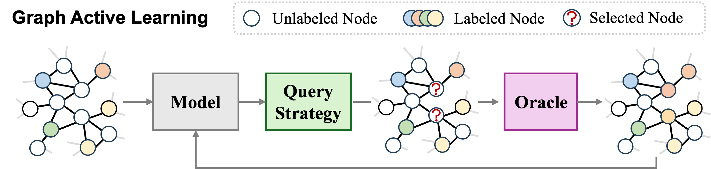
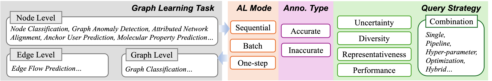

# Graph Active Learning: A Survey

A comprehensive collection of Graph Active Learning (GAL) papers.

## 💡 What is GAL?
> Graph Active Learning applies active learning to graph-structured data, strategically selecting valuable graph entities (nodes, edges, or subgraphs) for annotation to maximize GNN performance under limited labeling budgets.

## 🏷️ Taxonomy
We categorize GAL methods along three orthogonal dimensions that capture the fundamental design choices in graph active learning: how entities are queried (AL mode), the quality of obtained labels (annotation type), and the criteria for entity selection (query strategy).

### Active Learning Mode
- **Sequential**: Query one entity per iteration
- **Batch**: Query multiple entities per iteration  
- **One-step**: Query all entities in a single iteration

### Annotation Type  
- **Accurate**: Perfect oracle labels
- **Inaccurate**: Noisy oracle labels

### Query Strategy  
- **Uncertainty (U)**: Select entities where model is least confident
- **Diversity (D)**: Select entities distinct from labeled ones
- **Representative (R)**: Select prototypical entities covering distributions
- **Performance (P)**: Select entities with greatest model impact

<!-- > *In the table: ✓ = uses strategy, ✗ = doesn't use* -->

### Strategy Combination
- **Single**: Use one strategy only
- **Pipeline**: Apply strategies sequentially
- **Hyper-parameter**: Combine using fixed/adaptive weights
- **Optimization**: Learn optimal combination via RL/bandits
- **Hybrid**: Complex multi-stage combinations

## 📋 Paper Collection

| Paper | AL Mode | Anno. Type | U | D | R | P | Combination | Code | Datasets | Task Performance Evaluation |  Budget Efficiency Evaluation |  Computational Efficiency Evaluation | 
|-------|---------|------------|---|---|---|---|-------------|------|----------|---------|----------|----------|
| [GlobalSIP 2017] [MSD] [Active sampling for graph-aware classification](https://ieeexplore.ieee.org/abstract/document/8309039/) | Sequential | Accurate | ✗ | ✗ | ✗ | ✓ | Single | - | Coloncancer, Australian | Accuracy | Budget sensitivity analysis | Execution Time, Algorithmic complexity |
| [arXiv 2017] [AGE] [Active Learning for Graph Embedding](https://arxiv.org/pdf/1705.05085) | Batch | Accurate | ✓ | ✗ | ✓ | ✗ | Hyper-parameter | [Code](https://github.com/vwz/AGE) | Citeseer, CORA, Pubmed | Macro-F1, Micro-F1| Fixed budget evaluation,Budget sensitivity analysis| - |
| [IEEE TSP 2018] [-] [Data-adaptive Active Sampling for Efficient Graph-Cognizant Classification](https://arxiv.org/pdf/1705.07220) | Sequential | Accurate | ✗ | ✗ | ✗ | ✓ | Single | - | Synthetic (10x10 grid, LFR); Real-world (CORA, CITESEER, Political-blog, multiple UCI/LibSVM datasets) | Accuracy | Budget sensitivity analysis| Algorithmic Complexity,Memory Usage,Execution Time|
| [IJCAI 2018] [ANRMAB] [Active discriminative network representation learning](https://opus.lib.uts.edu.au/bitstream/10453/131527/1/Active%20discriminative%20network%20representation%20learning.pdf) | Batch | Accurate | ✓ | ✗ | ✓ | ✗ | Optimization | - | Cora, Citeseer, Pubmed | Macro-F1, Micro-F1| Fixed budget evaluation,Budget sensitivity analysis| - |
| [ICASSP 2018] [AG-SSL] [On the Supermodularity of Active Graph-Based Semi-Supervised Learning with Stieltjes Matrix Regularization](https://arxiv.org/pdf/1804.03273) | Sequential | Accurate | ✗ | ✗ | ✗ | ✓ | Single | - | Karate club network, Dolphin social network |Accuracy |Budget sensitivity analysis|-|
| [IJCAI 2019] [ActiveHNE] [ActiveHNE: Active Heterogeneous Network Embedding](https://arxiv.org/pdf/1905.05659) | Batch | Accurate | ✓ | ✗ | ✓ | ✗ | Optimization | - | DBLP, Cora, MovieLens | Accuracy |Budget sensitivity analysis| Execution Time
| [arXiv 2019] [FeatProp] [Active Learning for Graph Neural Networks via Node Feature Propagation](https://arxiv.org/pdf/1910.07567) | One-Step | Accurate | ✗ | ✗ | ✓ | ✗ | Single | [Code](https://github.com/CrickWu/active_graph) | Cora, Citeseer, Pubmed, CoraFull |Accuracy, Macro-F1, Micro-F1 |Fixed budget evaluation, Budget sensitivity analysis|Execution Time|
| [SIGKDD 2019] [RRQR] [Graph-based semi-supervised & active learning for edge flows](https://www.cs.cornell.edu/~arb/papers/flow-ssl-KDD-2019.pdf) | Batch | Accurate | ✗ | ✗ | ✗ | ✓ | Single | [Code](https://github.com/000Justin000/ssl_edge) | Synthetic flows (on Minnesota road network, etc.); Real-world flows (Transportation networks, Last.fm) | - | Budget sensitivity analysis|Algorithmic Complexity|
| [IJCAI 2019] [DALAUP] [Deep Active Learning for Anchor User Prediction](https://arxiv.org/pdf/1906.07318) | Batch | Accurate | ✓ | ✗ | ✗ | ✓ | Optimization | [Code](https://github.com/chengaf/DALAUP) | Foursquare and Twitter| Precision@30, MAP@30| Fixed budget evaluation, Budget sensitivity analysis|-|
| [WWW 2020] [ATNE] [Active domain transfer on network embedding](https://dl.acm.org/doi/pdf/10.1145/3366423.3380024) | Batch | Accurate | ✓ | ✗ | ✓ | ✗ | Hybrid | - | Citation Network, Co-author Network |Macro-F1 | Fixed budget evaluation| |
| [ICML 2020] [GEEM] [Active Learning on Attributed Graphs via Graph Cognizant Logistic Regression and Preemptive Query Generation](http://proceedings.mlr.press/v119/regol20a/regol20a.pdf) | Single | Accurate | ✓ | ✗ | ✗ | ✓ | Hyper-parameter | - | Cora, Citeseer, Pubmed, Amazon-Photo, Amazon-Computers | Accuracy |Budget sensitivity analysis, Fixed budget evaluation| Algorithmic Complexity|
| [NeurIPS 2020] [GPA] [Graph Policy Network for Transferable Active Learning on Graphs](https://proceedings.neurips.cc/paper/2020/file/73740ea85c4ec25f00f9acbd859f861d-Paper.pdf) | Sequential | Accurate | ✓ | ✗ | ✓ | ✗ | Optimization | [Code](https://github.com/ShengdingHu/GraphPolicyNetworkActiveLearning) | Reddit, Cora, Citeseer, Pubmed, Coauthor | Macro-F1, Micro-F1|Fixed budget evaluation, Performance-target evaluation, Budget sensitivity analysis | Execution Time, Memory Usage |
| [ACML 2020] [MetAL] [Metal: Active semi-supervised learning on graphs via meta-learning](http://proceedings.mlr.press/v129/madhawa20a/madhawa20a.pdf) | Sequential | Accurate | ✗ | ✗ | ✗ | ✓ | Single | [Code](https://github.com/Kaushalya/metal) | Cora, Citeseer, Pubmed, Coauthor-Physics, Coauthor-CS, Amazon-Computers | Accuracy, Macro-F1|Fixed budget evaluation, Budget sensitivity analysis|Execution time|
| [TNNLS 2020] [Seal] [Seal: Semisupervised adversarial active learning on attributed graphs](https://arxiv.org/pdf/1908.08169) | Sequential | Accurate | ✗ | ✓ | ✗ | ✗ | Single | - | Citeseer, Cora, Pubmed, DBLP | Macro-F1, Micro-F1| Fixed budget evaluation, Budget sensitivity analysis|Algorithmic Complexity, Execution Time|
| [SIGKDD 2020] [ASGN] [ASGN: An active semi-supervised graph neural network for molecular property prediction](https://arxiv.org/pdf/2007.03196) | Batch | Accurate | ✗ | ✓ | ✗ | ✗ | Single | [Code](https://github.com/HaoZhongkai/AS_Molecule) |  QM9, OPV | Mean Absolute Error (MAE) | Fixed budget evaluation, Label Rate-MAE curve, Budget sensitivity analysis | - |
| [VLDB 2021] [Grain] [Grain: Improving Data Efficiency of Graph Neural Networks via Diversified Influence Maximization](https://vldb.org/pvldb/vol14/p2473-zhang.pdf) | Batch | Accurate | ✗ | ✓ | ✓ | ✗ | Hyper-parameter | [Code](https://github.com/zwt233/Grain) |Cora, Citeseer, Pubmed, Reddit, ogbn-papers100M | Accuracy, Accuracy gap from best accuracy | Fixed budget evaluation, Budget sensitivity analysis | Execution Time,Speed-up |
| [SIGMOD 2021] [ALG] [ALG: Fast and Accurate Active Learning Framework for Graph Convolutional Networks](https://drive.google.com/file/d/1m7AZ_skox2hAZ2BDQnVoofh19fnDsS7d/view) | Batch | Accurate | ✓ | ✗ | ✓ | ✗ | Hyper-parameter | [Code](https://github.com/zwt233/ALG) | Cora, Citeseer, PubMed, Reddit | Accuracy|Budget sensitivity analysis, Fixed budget evaluation, Performance-target evaluation|Algorithmic Complexity, Execution Time |
| [NeurIPS 2021] [RIM] [RIM: Reliable Influence-based Active Learning on Graphs](https://proceedings.neurips.cc/paper/2021/file/eb86d510361fc23b59f18c1bc9802cc6-Paper.pdf) | Batch | Inaccurate | ✗ | ✗ | ✓ | ✗ | Single | [Code](https://github.com/zwt233/RIM) | Cora, Citeseer, PubMed, Reddit | Accuracy, Performance under labeling error rates | Fixed budget evaluation, Labeling error rate sensitivity, Budget sensitivity analysis | Execution Time,Speed-up |
| [WWW 2021] [ATTENT] [Attent: Active attributed network alignment](https://dl.acm.org/doi/pdf/10.1145/3442381.3449886) | Batch | Accurate | ✗ | ✗ | ✓ | ✗ | Single | [Code](https://github.com/BlueWhaleZhou/ATTENT_WWW21) | ACM Citation, DBLP Citation, Douban, Lastfm, Flickr, AMiner |Alignment Accuracy| Budget sensitivity analysis, Fixed budget evaluation|Algorithmic Complexity, Execution Time, Scalability, Speed-up |
| [IEEE TRANSACTIONS ON BIG DATA 2022] [ASGNN] [Active and semi-supervised graph neural networks for graph classification](https://ieeexplore.ieee.org/document/9669159/) | Batch | Accurate | ✓ | ✗ | ✓ | ✗ | Hyper-parameter | - | MUTAG, PTC_MR, COLLAB, BZR_MD, BZR, NCI1, PROTEINS, ER_MD, COX2_MD, DHFR, DHFR_MD, PTC_FR | Accuracy|Budget sensitivity analysis, Fixed budget evaluation, Performance-target evaluation|-|
| [CIKM 2022] [SMARTQUERY] [SmartQuery: An Active Learning Framework for Graph Neural Networks through Hybrid Uncertainty Reduction](https://arxiv.org/pdf/2212.01440) | Sequential | Accurate | ✗ | ✗ | ✓ | ✓ | Hybrid | - | Cora, Citeseer, Pubmed | Macro-F1, Micro-F1|	Fixed budget evaluation, Budget sensitivity analysis|	-|
| [AAAI 2022] [BIGENE] [Batch Active Learning with Graph Neural Networks via Multi-Agent Deep Reinforcement Learning](https://ojs.aaai.org/index.php/AAAI/article/view/20897) | Batch | Accurate | ✓ | ✓ | ✓ | ✗ | Optimization | - | Cora, Citeseer, Pubmed, Reddit, Coauthor-CS, Coauthor-Physics| Accuracy|Budget sensitivity analysis, Fixed budget evaluation |Execution Time , Speed-up|
| [WWW 2022] [ALLIE] [ALLIE: Active Learning on Large-scale Imbalanced Graphs](https://dl.acm.org/doi/pdf/10.1145/3485447.3512229) | Sequential | Accurate | ✓ | ✗ | ✓ | ✗ | Optimization | - | Cora, Citeseer, Pubmed, a proprietary e-commerce dataset|	Macro-F1, Micro-F1, Precision, Recall, F1 score|Fixed budget evaluation, Budget sensitivity analysis|Execution Time , Speed-up|
| [ICLR 2022] [IGP] [Information Gain Propagation: A New Way to Graph Active Learning with Soft Labels](https://arxiv.org/pdf/2203.01093) | Batch | Accurate | ✗ | ✗ | ✓ | ✓ | Hybrid | [Code](https://github.com/zwt233/IGP/tree/main) | Citeseer, Cora, PubMed, Reddit, ogbn-arxiv | Accuracy | Fixed budget evaluation, Budget sensitivity analysis | Algorithmic Complexity, Execution Time , Scalability, Speed-up|
| [SIGKDD 2022] [JuryGCN] [JuryGCN: Quantifying Jackknife Uncertainty on Graph Convolutional Networks](https://dl.acm.org/doi/pdf/10.1145/3534678.3539286) | Batch | Accurate | ✓ | ✗ | ✗ | ✗ | Single | [Code](https://github.com/BlueWhaleZhou/JuryGCN_UQ) | Cora, Citeseer, Pubmed, Reddit | Micro-F1 |Fixed budget evaluation, Budget sensitivity analysis | Running time, Memory usage, Speed-up|
| [ECML-PKDD 2022] [LSCALE] [LSCALE: Latent Space Clustering-Based Active Learning for Node Classification](https://arxiv.org/pdf/2012.07065) | Batch | Accurate | ✗ | ✓ | ✓ | ✗ | Pipeline | [Code](https://github.com/liu-jc/LSCALE) | Cora, Citeseer, Pubmed, Coauthor-CS, Coauthor-Physics |Accuracy| Fixed budget evaluation, Budget sensitivity analysis| Execution Time |
| [ICDM 2022] [MetRA] [Active Heterogeneous Graph Neural Networks with Per-step Meta-Q-Learning](https://ieeexplore.ieee.org/stamp/stamp.jsp?tp=&arnumber=10027676) | Batch | Accurate | ✓ | ✓ | ✓ | ✗ | Optimization | - | DBLP, ACM, AMiner |Macro-F1, Micro-F1 |Fixed budget evaluation, Budget sensitivity analysis|	-|
| [NeurIPS Workshop 2022] [AGE+FDS+SDS] [Dissimilar Nodes Improve Graph Active Learning](https://arxiv.org/pdf/2212.01968) | Batch | Accurate | ✓ | ✓ | ✓ | ✗ | Hyper-parameter | [Code](https://github.com/franklinnwren/DS-AGE) | Cora, Citeseer, Pubmed|Macro-F1, Micro-F1|Fixed budget evaluation, Budget sensitivity analysis|-|
| [LoG 2022] [MMPQ] [Jointly Modelling Uncertainty and Diversity for Active Molecular Property Prediction](https://proceedings.mlr.press/v198/zhou22b/zhou22b.pdf) | Batch | Accurate | ✓ | ✓ | ✗ | ✗ | Multiplication | - | Molecular Property Prediction (BACE, BBBP, HIV, SIDER (from MoleculeNet and OGB))|	AUROC|	Fixed budget evaluation, Performance-target evaluation, Budget sensitivity analysis|	- |
| [APWeb-WAIM 2022] [GADAL] [GADAL: An Active Learning Framework for Graph Anomaly Detection](https://link.springer.com/chapter/10.1007/978-3-031-25158-0_35) | Batch | Accurate | ✗ | ✗ | ✓ | ✓ | Hyper-parameter | - | YelpChi, Amazon | Macro-F1, AUROC, Recall, GMean, SIR (Selected anomalous and normal node ratios) | Fixed budget evaluation, Performance-target evaluation | -  |
| [ICLR 2023] [SCARCE] [Structural Fairness-aware Active Learning for Graph Neural Networks](https://openreview.net/pdf?id=bvjcMvMn7B) | One-Step | Accurate | ✗ | ✗ | ✓ | ✓ | Optimization | - | Cora, Citeseer, Pubmed, Amazon-Computers, Amazon-Photo, ogbn-arxiv, OGB Products | Accuracy | Fixed budget evaluation, Performance-target evaluation, Budget sensitivity analysis | Algorithmic Complexity, Scalability |
| [IJCAI 2023] [GFlowGNN] [Generative Flow Networks for Precise Reward-Oriented Active Learning on Graphs](https://arxiv.org/pdf/2304.11989) | Sequential | Accurate | ✓ | ✗ | ✓ | ✗ | Optimization | - | Cora, Citeseer, Pubmed, 5 Reddit datasets | Accuracy, Macro-F1, Micro-F1 | Fixed budget evaluation, Budget sensitivity analysis | Training Speed (Convergence) |
| [ECML-PKDD 2023] [DiffusAL] [DiffusAL: Coupling Active Learning with Graph Diffusion for Label-Efficient Node Classification](https://arxiv.org/pdf/2308.00146) | Batch | Accurate | ✓ | ✓ | ✓ | ✗ | Multiplication | [Code](https://github.com/lmu-dbs/diffusal/tree/main) | Cora, Citeseer, Pubmed, Coauthor-CS, Coauthor-Physics | Accuracy | Fixed budget evaluation, Budget sensitivity analysis | Execution Time  |
| [CIKM 2023] [SAG] [Mitigating Semantic Confusion from Hostile Neighborhood for Graph Active Learning](https://arxiv.org/pdf/2308.08823) | Batch | Accurate | ✗ | ✓ | ✓ | ✗ | Hyper-parameter | [Code](https://github.com/YoungTimmy/SAG) | Cora, Citeseer, Pubmed, Hpay | Accuracy, Macro-F1, AUROC, Binary F1 | Fixed budget evaluation, Performance-target evaluation, Budget sensitivity analysis | Execution Time, Speed-up |
| [TKDD 2023] [OWGAL] [Open-World Graph Active Learning for Node Classification](https://dl.acm.org/doi/pdf/10.1145/3607144) | Batch | Accurate | ✓ | ✗ | ✗ | ✗ | Hyper-parameter | - |Amazon-Computer, Amazon-Photo, Coauthor-CS, Coauthor-Physics, Arxiv, Reddit, Products | Macro-F1, Micro-F1 | Fixed budget evaluation, Performance-target evaluation, Budget sensitivity analysis | Algorithmic Complexity, Execution Time  |
| [TMLR 2023] [GraphPart] [Partition-Based Active Learning for Graph Neural Networks](https://arxiv.org/pdf/2201.09391.pdf) | One-Step | Accurate | ✗ | ✓ | ✓ | ✗ | Pipeline | [Code](https://github.com/Mars-tin/GraphPart/tree/master) | Citeseer, Cora, Pubmed, Corafull, Ogbn-Arxiv, Co-author CS, Co-author Physics  | Macro-F1, Micro-F1 | Fixed budget evaluation, Budget sensitivity analysis | Algorithmic Complexity |
| [ICTAI 2023] [ERF-attention] [Graph Active Learning at Subgraph Granularity](https://ieeexplore.ieee.org/abstract/document/10356459) | Batch | Inaccurate | ✓ | ✓ | ✓ | ✗ | Hyper-parameter | - | AMLSim | Accuracy, F1 score | Budget sensitivity analysis, Fixed budget evaluation | - |
| [WWW 2024] [GreedyET] [Cost-effective Data Labelling for Graph Neural Networks](https://dl.acm.org/doi/pdf/10.1145/3589334.3645339) | Sequential | Accurate | ✗ | ✓ | ✓ | ✗ | Hyper-parameter | [Code](https://github.com/rmitbggroup/AL-Greedy/tree/main) | Cora, CiteSeer, PubMed, Coauthor Physics, Flickr, Ogbn-arxiv | Accuracy | Fixed budget evaluation, Budget sensitivity analysis | Algorithmic Complexity, Execution Time, Memory usage, Speed-up |
| [NeurIPS 2024] [DOCTOR] [No Change, No Gain: Empowering Graph Neural Networks with Excepted Model Change Maximization for Active Learning](https://proceedings.neurips.cc/paper_files/paper/2023/file/944ecf65a46feb578a43abfd5cddd960-Paper-Conference.pdf) | Sequential | Accurate | ✗ | ✗ | ✗ | ✓ | Single | - | Citeseer, Cora, PubMed, Reddit, ogbn-arxiv | Accuracy | Fixed budget evaluation, Budget sensitivity analysis | Algorithmic Complexity, Execution Time , Speed-up |
| [ICDE 2024] [NC-ALG] [NC-ALG: Graph-based Active Learning under Noisy Crowd](https://ieeexplore.ieee.org/stamp/stamp.jsp?tp=&arnumber=10597796) | Batch | Inaccurate | ✗ | ✗ | ✓ | ✗ | Single | [Code](https://github.com/zwt233/NC-ALG) | Citeseer, Cora, PubMed, Reddit, ogbn-arxiv | Accuracy | Fixed budget evaluation, Performance-target evaluation, Budget sensitivity analysis | Algorithmic Complexity, Execution Time, Speed-up |
| [UAI 2024] [ALIN] [ALIN: An Active Learning Framework for Incomplete Networks](https://openreview.net/pdf?id=n6wh6WiWvV) | Batch | Accurate | ✓ | ✗ | ✓ | ✗ | Hyper-parameter | [Code](https://github.com/manhtung001/ALIN) | Cora, Citeseer, Pubmed, Coauthor-CS| Macro-F1 | Fixed budget evaluation, Budget sensitivity analysis | - |
| [arXiv 2024] [MITIGATE] [Multitask Active Learning for Graph Anomaly Detection](https://arxiv.org/pdf/2401.13210) | Batch | Accurate | ✓ | ✓ | ✓ | ✗ | Hybrid | [Code](https://github.com/AhaChang/MITIGATE) | Graph Anomaly Detection (Cora, Citeseer, BlogCatalog, Flickr) | AUROC, AUPRC | Fixed budget evaluation, Performance-target evaluation, Budget sensitivity analysis | - |
| [Expert Systems with Applications 2024] [GALMI] [Adaptive graph active learning with mutual information via policy learning](https://pdf.sciencedirectassets.com/271506/1-s2.0-S0957417424X00172/1-s2.0-S0957417424016403/main.pdf) | Sequential | Accurate | ✗ | ✓ | ✓ | ✗ | Optimization | - | Cora, Citeseer, Pubmed, Chameleon | Accuracy | Fixed budget evaluation, Budget sensitivity analysis | Algorithmic Complexity |
| [Communications on Applied Mathematics and Computation 2024] [MC] [Model Change Active Learning in Graph-Based Semi-supervised Learning](https://arxiv.org/pdf/2110.07739) | Batch | Accurate | ✗ | ✗ | ✗ | ✓ | Single | [Code](https://github.com/millerk22/model-change-paper) |  Binary-Clusters (synthetic), MNIST, Salinas A, Urban | Accuracy | Fixed budget evaluation, Budget sensitivity analysis | Execution Time |
| [SDM 2024] [GALClean] [Active Learning for Graphs with Noisy Structures](https://epubs.siam.org/doi/pdf/10.1137/1.9781611978032.30) | Batch | Accurate | ✗ | ✓ | ✓ | ✗ | Pipeline | - | Cora, Citeseer, Pubmed, Amazon-photo, Amazon-Computer, Coauthor-CS | Accuracy | Fixed budget evaluation, Budget sensitivity analysis | Algorithmic Complexity |
| [IDA 2024] [SPA] [A Structural-Clustering Based Active Learning for Graph Neural Networks](https://arxiv.org/pdf/2312.04307) | Batch | Accurate | ✗ | ✗ | ✓ | ✗ | Pipeline | [Code](https://github.com/rickymaulanafajri/SPA) | Citeseer, Pubmed, Corafull, WikiCS, Minesweeper, Tolokers | Accuracy, Macro-F1 | Fixed budget evaluation, Budget sensitivity analysis | Execution Time |
| [DMKD 2024] [STAL] [Improving graph neural networks by combining active learning with self-training](https://link.springer.com/article/10.1007/s10618-023-00959-z) | Batch | Accurate | ✓ | ✗ | ✓ | ✗ | Hyper-parameter | [Code](https://github.com/nneinn/STAL/tree/main) | Cora, Citeseer, Pubmed, ogbn-arxiv | Accuracy | Fixed budget evaluation, Performance-target evaluation, Budget sensitivity analysis | - |
| [TMLR 2025] [LEGO-Learn] [LEGO-Learn: Label-Efficient Graph Open-Set Learning](https://arxiv.org/pdf/2410.16386) | Batch | Accurate | ✓ | ✗ | ✓ | ✗ | Pipeline | - | Cora, AmazonComputers, AmazonPhoto, LastFMAsia | Accuracy, AUROC, AUPRC, FPR@95, Precision | Fixed budget evaluation | - |
| [CIKM 2024] [GraphCBAL] [GraphCBAL: Class-Balanced Active Learning for Graph Neural Networks via Reinforcement Learning](https://dl.acm.org/doi/10.1145/3627673.3679624) | Sequential | Accurate | ✓ | ✓ | ✓ | ✗ | Optimization | - | Cora, Citeseer, Pubmed, Reddit, Coauthor-CS, Coauthor-Physics | Macro-F1, Micro-F1, Imbalance Ratio | Fixed budget evaluation, Budget sensitivity analysis | Algorithmic Complexity |
| [Neural Networks 2025] [DGAL] [Disentangled Active Learning on Graphs](https://www.sciencedirect.com/science/article/pii/S0893608025000097) | Sequential | Accurate | ✓ | ✗ | ✗ | ✗ | Single | - | Cora, Citeseer, Pubmed, DBLP, Reddit, Facebook, Computer, Photo | Macro-F1, Micro-F1 | Fixed budget evaluation, Budget sensitivity analysis | Algorithmic Complexity |

<!-- ## 📖 Citation

If you find this collection useful, please cite our survey: -->
